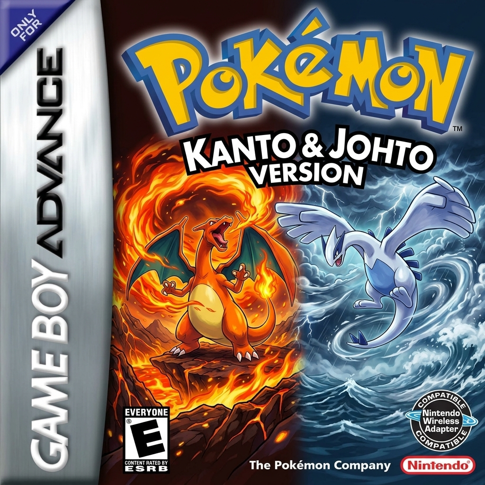

# Pokémon: Kanto & Johto Definitivo

> **Unified GBA 32MB Engine, ROM Injection Suite & Desktop Management Hub**

[](https://github.com/guuhferiani/pokemon-gba)
[](https://love2d.org)
[](https://python.org)
[](LICENSE)

<p align="center">
  
</p>

---

## 🧭 Visão Geral

O projeto **Pokémon: Kanto & Johto Definitivo** unifica duas das regiões mais icônicas da franquia em uma experiência contínua e desafiadora. O jogador inicia sua jornada em **Kanto**, conquista a Liga Índigo e viaja com sua equipe para desbravar **Johto** em alto nível (Lv 55–100), enfrentando líderes de ginásio redimensionados, novos mapas e o confronto definitivo no topo do Mt. Silver.

O ecossistema inclui um **Desktop Management Hub** desenvolvido em Lua/LÖVE com suporte a visualização de capas autênticas, sincronização automática de saves (.sav/.srm), gerenciador de mods e suíte de injeção binária em Python.

---

## ⚡ Recursos & Arquitetura

- **Jornada Contínua de 16 Insígnias:** Progressão direta Kanto ➔ Johto com curva de dificuldade adaptada para veteranos.
- **Engine Binária Expandida (32MB):**
  - Tabela estendida de 752 treinadores repontada em `0x09840000`.
  - Novos bancos de mapas e encontros selvagens repontados em `0x09900000` e `0x09980000`.
  - Script de transição no Porto de Vermilion (S.S. Aqua) em português com hook direto em NPCs.
  - Tela de título personalizada com artes de Lugia e Charizard em alta fidelidade.
- **Melhorias de Qualidade de Vida (QoL):**
  - *Physical/Special Split* (Separação Físico/Especial Gen 4+).
  - *Run Indoors* (Correr dentro de edificações e centros Pokémon).
  - Remoção de travas de evolução por troca e desbloqueio da Pokédex Nacional.
- **Desktop Hub & Ferramentas:**
  - Carregador com visualizador de capa box art oficial.
  - Leitor e sincronizador de saves em tempo real (Badges, Pokédex, Horas de jogo).
  - Editor seguro de save com recálculo automático de checksums.

---

## 📂 Estrutura do Repositório

```text
├── assets/          # Capas e artes em alta resolução (Box Art GBA)
├── docs/            # Especificações de design e arquitetura do projeto
├── mods/            # Módulos e patches independentes (QoL, traduções)
├── src/             # Código-fonte do Launcher Hub em Lua / LÖVE
│   ├── core/        # Parsers de ROM, decodificadores de Save e injeção de dados
│   ├── render/      # Shaders e pipeline gráfico
│   └── ui/          # Interface gráfica, componentes e views
├── tools/           # Suíte de engenharia reversa e injeção binária (Python)
├── jogar.bat        # Atalho de inicialização rápida no Windows
├── conf.lua         # Configurações de display e renderização
└── main.lua         # Ponto de entrada do ecossistema
```

---

## 🚀 Como Utilizar

### 1. Iniciar o Launcher Desktop
Certifique-se de possuir o [LÖVE 11.5+](https://love2d.org) instalado e execute:
```powershell
.\jogar.bat
```
*Ou alternativamente:*
```powershell
love .
```

### 2. Suíte de Testes Automatizados (CI)
Para validar o carregamento dos módulos, integridade de componentes e lógica de saves:
```powershell
lovec . --ci
```

### 3. Compilar a ROM Unificada (Ferramentas)
Com sua ROM base colocada no diretório `roms/`, execute a suíte de injeção:
```powershell
python tools/kj_rom_engine.py
python tools/patch_title_screen.py
```

---

## ⚖️ Aviso Legal & Direitos Autorais

### Integridade e Marcas Registradas da Nintendo
**Pokémon**, **Game Boy Advance**, nomes de personagens, insígnias, sprites e elementos temáticos associados são marcas registradas e propriedades intelectuais exclusivas da **Nintendo Co., Ltd.**, **Game Freak Inc.** e **Creatures Inc.**

Este é um projeto não oficial, feito por fãs, estritamente **sem fins lucrativos**, com finalidade didática, de pesquisa em computação gráfica e preservação histórica de software. **Nenhuma ROM comercial ou arquivo protegido por direitos autorais proprietários é distribuído neste repositório.**

### Direitos Autorais das Modificações
Todo o código original de engenharia de software desenvolvido para este projeto — incluindo a arquitetura do Launcher Desktop (`src/`), a suíte de ferramentas de injeção binária (`tools/`), os parsers e algoritmos de recálculo de checksums, documentações e utilitários — é de autoria e propriedade de **Gustavo Feriani** e colaboradores do projeto, disponibilizado sob os termos da licença [MIT](LICENSE).
